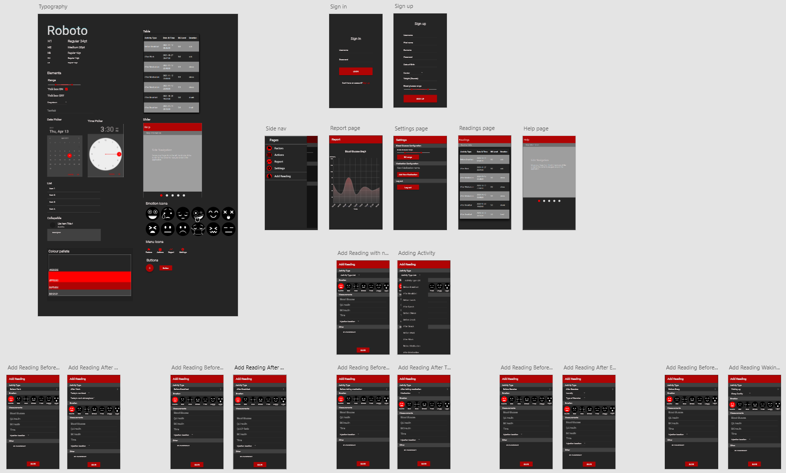

# Diabetes Management Mobile Web App

A Diabetes Management Mobile Web App (DMMWA) designed to help individuals who have diabetes to record and manage their diabetes easily.

Features of the DMMWA include:
* Signing up or logging in to your unique account
* Entering your readings, which also records your recent activity and emotion
* Dynamically displaying your uniqbbue readings
* Data vizualize your readings
* Configurating your account
* Help page for instructions how to use the app

This project solified my knowledge of:

 1) Programming languages:
    *	HTML 
    * CSS 
    * JavaScript 
    *	PHP (new skill)

 2) Database:
    *	MySQL (SQL)

 3) Cross-platform web server stack package:
    *	XAMPP (new skill)
    
 4) Web development IDE:
    *	Dreamweaver (new skill)

 5) Web development tool:
    * Chrome DevTool
  
 6) UI Tool:
    * Adobe XD

 7) Front-end framework:
    *	Materialize front end framework (new skill)

 8) Web stack:
    * WAMP web stack (new skill)

 9) Softawre development Lifecycle:
    * Agile
    * SCRUM   
     
If you wish to run the application you will need to install XAMPP and follow their instructions to testing a webpage.
 
The DMMWA follows the HCI and Web Design principles. 
© Copyright

